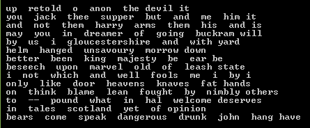
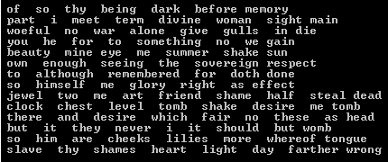

# HMM ML Assignment 2

Dataset used:

Name: Shakespeare plays text corpus

File: alllines.txt (Rename and place it in dataset/shakespeare.txt for our code reading)

We already have 2 files in dataset folder. Shakespeare.txt (smaller 3000 lines version) and Shakespeare_big.txt with full original data.

Link: https://www.kaggle.com/kingburrito666/shakespeare-plays 

# Required Libraries/Modules:

Python3 (3.5.2 used)

NLTK (pip3 install nltk)

Pickle

CMUDICT

(
Use following commands in terminal to use CMUDICT:

python3

>>> import nltk

>>> nltk.download('cmudict')

)

# Process and Algorithms:
First we performed tokenization. Before that, please remove all double quotes from input txt file. We did that by using replace all feature of notepad++. Input text was tokenized into words using NLTK function word_tokenizer. Reason is that we treat word as the basic building for our problem definition that can be used to auto-generate complex sentences or poems. For generation part as defined in given problem part 1, we aimed at auto generating 14 lines poem from given Shakespeare text corpus. 
We used Baum-Welch algorithm to perform unsupervised learning of our generative HMM. It is an EM based forward-backward algorithm to facilitate unsupervised HMM training. Two parameters we focused on, during learning process, are:

1) EM total iterations
2) Total number of hidden states decision

For EM iterations, we used total 1000 iterations as those were observed to be enough for acceptable convergence. Also, training on original txt file, with 1,11,396 lines of text, took several hours so we started with smaller version of this file with around 3,000 lines of text. For deciding total number of hidden states, we tried with different numbers (8, 10, 12, 15, 20, 25, 30 etc.). Based on qualitative analysis, we found 20 hidden states to be more than enough amid not lengthening learning procedure too much. After training on given text dataset, we have our transition and emission probabilities matrices that are at the core of HMM procedure.

For poem generation, we also have to keep track of syllables. For that we used CMU based NLTK library. Generation process is as given below:

1. Pick a uniformly random states to begin at
2. Initialize an empty line and initialize the syllable count of this line to zero.
3. Sample the next state based on the previous state and the transition matrix probabilities.
4. Add a word to the line based on the current state and the observation matrix probabilities
5. Count the number of syllables in the added word and add it to a syllable count
6. Repeat steps 3-5 until we have created a line with at least 10 syllables. Save this line to our poem.
7. Repeat steps 1-6 until we have generated 14 lines for our poem.

For step 5 we used CMU NLTK library as defined above.

For text prediction, we used forward algorithm to get next word. But it is to be noted that this is extendable to n number of next word predictions. We treat this as "computing likelihood" problem. Basic idea is to get the likelihood for given sequence of words using HMM, but not navigating to the last/end token at the last step. For n given words, we proceed till nth step and then calculate the values for the states in the (n+1)th step. So in the end for observations, we get n*V  scores, where V is the dictionary size of the observation. We choose the largest score and find the corresponding state and observation which would be the next predicted world for given sequence of words. In same way, we can extend it to predict next x words. In our implementation, we tested for next 5 words.

**For automated poem generation use following command from src directory:**

**python3 generation.py**

**and following for prediction:**

**python3  prediction.py <text file name> <number of next words to be predicted (between 1 to 5 inclusive, for all 
other values we take it = 1)**

**e.g. python3 prediction.py test.txt 5**

**Given sequence of words should be placed in test.txt file in one line with space separation.**

For training your own HMM, you have to copy and rename your dataset file to "Shakespeare.txt" in dataset directory. Also, don't forget to remove " quotes sign from all lines in your txt file. Then use following command to train your model (Smaller dataset file (3000 lines of code) takes around 2 hours while full Shakespeare dataset txt file takes several hours to train completely).

**python3 learning.py**

# Results:
Note: Trained model attached right now with code is utilizing smaller version of Shakespeare dataset (3000 lines of text as discussed above). You should train it first using given training command as above and use  "shakespeare_big.txt" (in dataset directory of project). Remember to rename it to "shakespeare.txt".

Following 2 poems are automatically generated using our model. First one using smaller/minimized version of Shakespeare.txt (3000 lines) and second one using full data file Shakespeare.txt.

As you can see that results are much better qualitatively using bigger version of dataset as it gives much more options to the algorithm to play with.

Also, following results depict next word(s) predictions for different given sequence of words.

As we can see, it's very hard to predict sensible and better word(s) predictions using HMM. That's why we think researchers shifted towards LSTM based models. Also, it can be observed that more required number of predicted words degrade the quality of final sentence.
